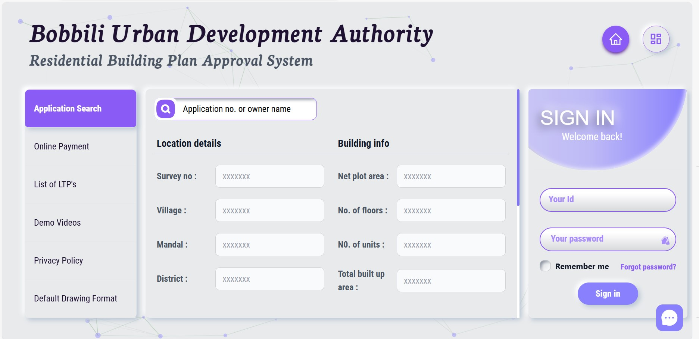
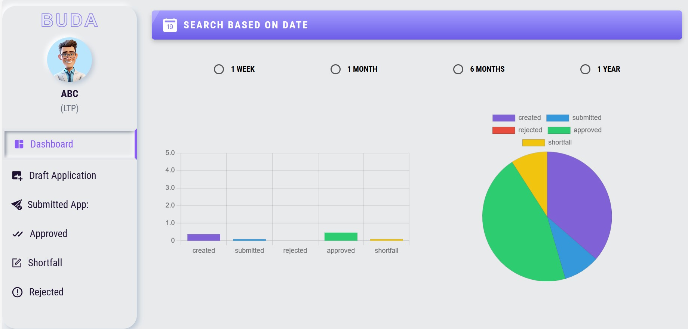
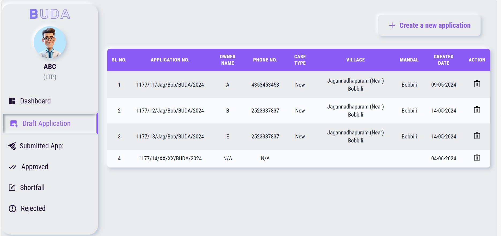

# Bobbili Urban Development Authority

A website to submit building approval application.

### Live website link: [(https://bpa-buda.ap.gov.in/)]

## Features

- The applicant can create a new application
- Applicant files will be stored in the google drive
- Applicant can view their submitted files
- Payment integration
- The application reviewer will review the application and submit his decision
- The applicant can see the application status from the dashboard
- The applicant can submit his query
- Admin will reply the messages
- Admin can add, delete and update user informations

## Screenshots

## Tech Stack

**Client:** React,TailwindCSS, ES6, JavaScript, DaisyUi, TanStackQuery, React-icon, Lottie, React-hook-form, Online payment system, React-router, React-hot-toast

**Server:** Node, Express, MongoDB, ImageBB

**Image Hosting** Google Drive

## Applicant

id: ltp-dev
password: ltp1

## Reviewer

id: testps
password: testps

## Admin

id: admin2
password: admin2
